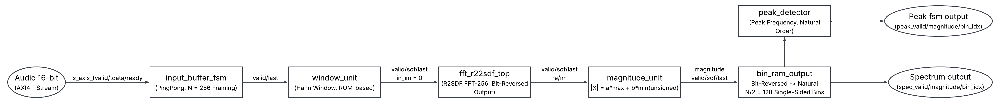
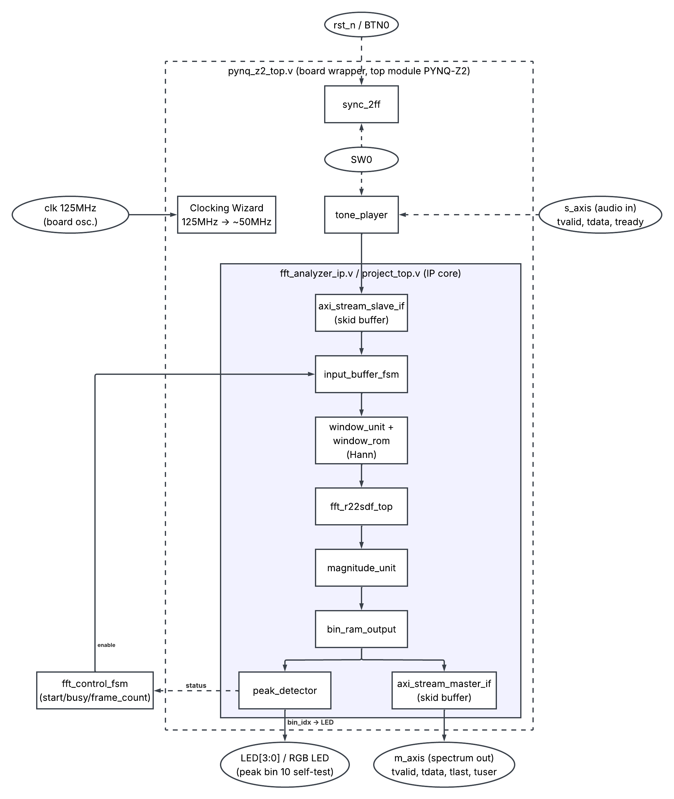
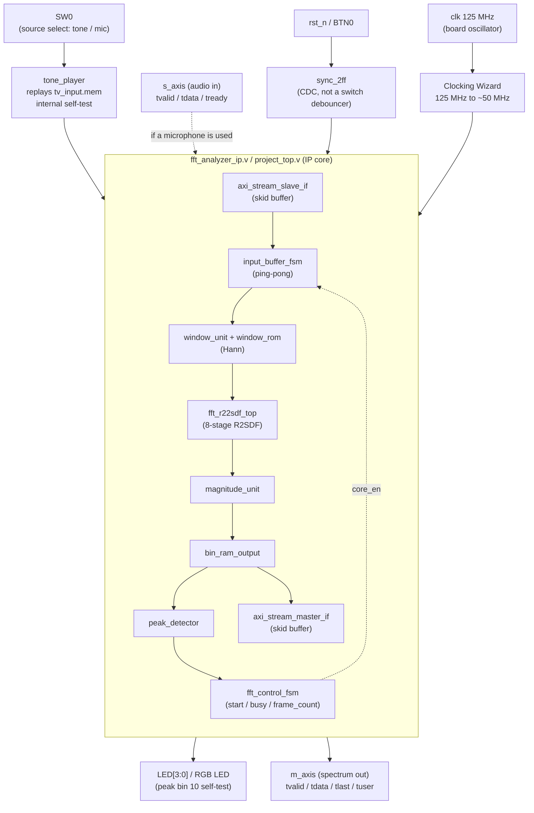
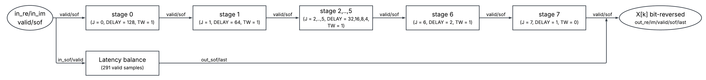
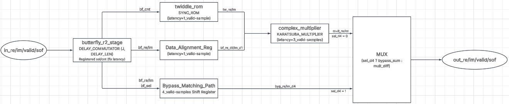

# FFT-Based Audio Spectrum Analyzer IP Core

A real-time audio spectrum analyzer IP core for FPGA, built around a **256-point FFT in the
R2SDF (Radix-2 Single-path Delay Feedback) architecture**, **Q1.15** fixed-point arithmetic,
and **AXI4-Stream** interfaces on both ends. Coursework project for **COS201 — Communication
Systems**.

Target board: **Digilent PYNQ-Z2** (Zynq XC7Z020CLG400-1). Synthesized, implemented,
**timing closed**, and a bitstream is available at `bitstream/pynq_z2_top.bit`.

-blue)


---

## Table of Contents

- [Overview](#overview)
- [Results at a Glance](#results-at-a-glance)
- [Processing Chain](#processing-chain)
- [Top-Level Module](#top-level-module)
- [FFT Core Architecture](#fft-core-architecture)
- [Module Reference](#module-reference)
- [Key Design Decisions](#key-design-decisions)
- [Interface Specification](#interface-specification)
- [Repository Structure](#repository-structure)
- [Verification: RTL vs. Python Golden Model](#verification-rtl-vs-python-golden-model)
- [PPA Results](#ppa-results)
- [Board Bring-Up](#board-bring-up)
- [Paper and Citation](#paper-and-citation)
- [Authors](#authors)

---

## Overview

This core computes a 256-point FFT of a streaming audio signal and reduces each transform to a
128-bin single-sided magnitude spectrum plus a per-frame spectral peak. It targets embedded
spectral front ends — keyword spotting, acoustic event detection, machine condition
monitoring, instrumentation — on devices where the FFT is not instantiated by a vendor
library but is itself the object of study.

The architecture is deliberately conventional: Cooley–Tukey decimation-in-frequency, an SDF
pipeline, Q1.15 fixed-point arithmetic with per-stage scaling, a three-multiply complex
product, a Hann window, and an α-max-β-min magnitude estimator. **No claim of architectural
novelty is made.** What this repository offers instead is a fully open RTL description paired
with the bit-accurate Python model that both *generates its coefficient memories* and *serves
as its verification oracle*, a bottom-up bit-exact verification result at every level of the
hierarchy, and a post-place-and-route PPA characterization that separates measured numbers
from derived ones.

---

## Results at a Glance

| Metric | Value | Basis |
|---|---|---|
| Functional correctness | Bit-exact vs. Python oracle at all 7 levels | Measured (simulation) |
| Core SQNR vs. golden model | 204.6 dB → zero absolute error | Measured |
| Fixed-point SQNR, Q1.15 vs. float64 | 58–61.6 dB across seeds; 6.02 dB/bit slope | Measured + re-derived |
| Python model vs. `numpy.fft` | ~1e-16 agreement | Measured |
| Slice LUT | 4 432 (8.33 %) | Post-P&R report |
| Slice Register | 4 328 (4.07 %) | Post-P&R report |
| Slice | 1 882 (14.15 %) | Post-P&R report |
| Block RAM | 7.5 tiles (5.36 %) | Post-P&R report |
| DSP48E1 | **24** (10.91 %) — matches the analytic model exactly | Post-P&R + derived |
| Board timing | WNS **+2.510 ns**, timing met @ 49.98 MHz | Post-route report |
| Throughput | 1 sample / enabled clock ≈ 195 k transforms/s @ 50 MHz | Derived |
| Real-time margin | ≈ **1040×** over the 48 kS/s requirement | Derived |
| Core latency | **291 valid samples**, constant every frame | Measured + analytically decomposed |


---

## Processing Chain



`input_buffer_fsm` (N=256 frame buffering, AXI4-Stream protocol) → `window_unit` (Hann
window) → `fft_r22sdf_top` (256-point R2SDF FFT, bit-reversed output) → `magnitude_unit`
(spectral magnitude) → `bin_ram_output` (reordering to natural sequence, N/2 = 128 bins) →
branching in parallel to the **full spectrum** (`Spectrum output`) and the **spectral peak**
via `peak_detector` (`Peak fsm output`).

- **Bin-to-frequency mapping:** `f_k = k · f_s / N`. With `f_s = 48 kHz` this gives
  **187.5 Hz per bin** over a 128-bin single-sided spectrum (the audio input being
  real-valued).
- Output framing follows a `sof` / `valid` / `last` protocol that self-labels each sample's
  position within the frame; no explicit address bus is used.

---

## Top-Level Module

`pynq_z2_top.v` is the module actually programmed onto the board. It wraps the IP core
(`fft_analyzer_ip.v` / `project_top.v`) and adds board-specific infrastructure: a Clocking
Wizard, clock-domain crossing, and an internal self-test source — the PYNQ-Z2 has no onboard
PDM microphone.



- **`tone_player`** replays `tv_input.mem` — the same golden test vector used in simulation,
  whose spectral peak sits at **bin 10** (1875 Hz) — as an internal stimulus. This confirms
  the whole chain runs correctly on real silicon before any external audio source is needed.
- **Clocking Wizard** divides the 125 MHz board oscillator down to ~50 MHz for the design's
  main clock domain (see [PPA Results](#ppa-results)).

<details>
<summary>English text-source version of the same diagram (renders natively on GitHub)</summary>


</details>

---

## FFT Core Architecture

### Eight R2SDF stages

Stage *J* owns a feedback delay line of `DELAY_LEN = N >> (J+1)` complex words (128, 64, 32,
16, 8, 4, 2, 1), so the delay-line requirement totals `N − 1 = 255` words — the theoretical
minimum memory for a pipelined FFT. The final stage sets `TW = 0` (`HAS_TWIDDLE = 0`) because
W⁰ = 1, leaving **seven** general complex multipliers.




### Inside one stage

Each stage contains a delay-commutator butterfly, a synchronous twiddle ROM, a Karatsuba
three-multiply complex multiplier, and a bypass path for the sum stream. The two branches are
**delay-matched exactly**:

- twiddle branch = ROM (1 cycle) + complex multiplier (3 cycles) = **4** valid samples
- bypass branch = matched shift register = **4** valid samples




If the complex multiplier pipeline depth changes from 3 to *P*, the bypass path must become
`1 + P` **and** the top-level `FFT_LATENCY` parameter must be recomputed.

---

## Module Reference

| Module | Role | Technique / algorithm |
|---|---|---|
| `butterfly_r2_stage` | Add/subtract butterfly + delay commutator | Internal delay line `DELAY_LEN = N>>(J+1)` (128…1), ÷2 scaling per stage, **convergent rounding** (round-half-to-even) + saturation |
| `twiddle_rom` | Twiddle factors $W_N^k$ | Synchronous ROM, N/2 coefficients, 1-cycle read |
| `complex_multiplier` | Complex multiplication | **Karatsuba, 3 real multiplies** instead of 4; 3-stage pipeline → 3 valid-sample latency |
| `stage_with_twiddle` | One assembled FFT stage | 4-cycle twiddle branch in parallel with a 4-cycle bypass branch (delay-matched), MUX driven by a correctly delayed `sel_o` |
| `fft_r22sdf_top` | Eight assembled stages | 256-point DIF FFT, throughput 1 sample/cycle, **bit-reversed** output |
| `window_unit` + `window_rom` | Windowing | Hann window applied before the FFT (reduces spectral leakage) |
| `magnitude_unit` | Spectral magnitude | **α-max-β-min** approximation (α = 31471, β = 13036) in place of a resource-expensive `sqrt(re²+im²)` |
| `bin_ram_output` | Reordering | Bit-reversed → natural order; folds the symmetric spectrum to N/2 = 128 single-sided bins |
| `peak_detector` | Peak search | Running comparison within one frame, emits `peak_magnitude` + `peak_bin_idx` |
| `input_buffer_fsm` | Frame buffering | Ping-pong buffer, N = 256, inserts one bubble cycle between frames |
| `axi_stream_slave_if` / `axi_stream_master_if` | IP boundary | Skid buffer, honours `tready` / `tvalid` backpressure |
| `fft_control_fsm` | Control | `start` / `busy` / `core_en` / `frame_count` |


---

## Key Design Decisions

**End-to-end valid-gating (`en`).** Every block — ROMs, complex multipliers, framing delay
lines — carries an enable tied to `valid`. The pipeline therefore advances in the **sample
domain**, not the clock domain, and all latency figures are quoted in valid samples. This
makes the inter-frame bubble transparent, and it lets the core run from an arbitrarily sparse
source: 48 kS/s on a 50 MHz fabric is one sample per ~1042 cycles, with no FIFO, rate matcher,
or handshake change.

**÷2 scaling per stage** (1/N overall after 8 stages) is mandatory to prevent Q1.15 overflow.
The effect is dramatic and worth stating quantitatively: without scaling, SQNR collapses to
**~1.5 dB** (overflow noise dominates); with it, SQNR is **~60 dB**. Because
`|a ± b|/2 ≤ max(|a|, |b|)`, the schedule makes overflow structurally impossible rather than
merely unlikely.

**Number formats.** Q1.15 signed for complex data; unsigned 16-bit for magnitude; Q8.8 for the
approximate `log2` output (optional, `ENABLE_LOG`).

---

## Interface Specification

Full detail in `docs/interface_spec.md`. Summary:

| Parameter | Default | Meaning |
|---|---|---|
| `N` | 256 | FFT size (samples per frame) |
| `DATA_WIDTH` | 16 | Sample/bin width (Q1.15) |
| `FFT_LATENCY` | **291** | Core latency in valid samples |
| `ENABLE_LOG` | 1 | Emit `out_mag_log2` (Q8.8, approximate log2) |

Both the AXI4-Stream slave (audio in) and master (spectrum out) implement `tvalid` / `tready`
backpressure through a skid buffer. The spectrum output is single-sided and in natural order,
with `tuser[0]` = start-of-frame and `tlast` = final bin (N/2 − 1).

---

## Repository Structure

```
rtl/
  core/           # FFT core: butterfly, twiddle ROM, complex multiplier, R2SDF top
  system/         # Pre/post-processing + IP integration: window, magnitude, bin reorder,
                  # peak detector, control FSM, project_top, fft_analyzer_ip
  interfaces/     # axi_stream_slave_if / axi_stream_master_if
  board/          # PYNQ-Z2 board wrapper: pynq_z2_top, tone_player, sync_2ff
tb/
  tb_fft_r22sdf.v # FFT core testbench (sweeps offset, self-measures latency)
  tb_top.sv       # System-level testbench (SystemVerilog)
  unit_tests/     # Dedicated testbenches for 4 modules: twiddle_rom, butterfly,
                  # magnitude, bin_ram
python/
  gen_*.py, compare_sqnr.py   # Generate ROMs/golden vectors + SQNR comparison
  unit_test_gen/              # golden_model_fft.py + vector generation for the 4 unit tests
sim/
  vectors/              # System-level golden vectors (.mem)
  unit_test_vectors/    # Per-module golden vectors (.mem/.txt)
constraints/       # pynq_z2.xdc, timing_only.xdc
docs/
  images/           # flow_diagram.png, top_module_diagram.png,
                    # fft_core_stages.png, r2sdf_stage.png
  reports/          # Vivado timing/utilization reports (post-P&R)
  interface_spec.md # Full IP port specification
bitstream/
  pynq_z2_top.bit  # Built bitstream, ready to program
```

Because `golden_model_fft.py` *generates* the `.mem` files that initialise the ROMs, a
coefficient mismatch between model and hardware is structurally impossible. That is
deliberate, and it eliminates an entire class of verification failure.

---

## Verification: RTL vs. Python Golden Model

Verification proceeds **bottom-up, one block at a time**: each RTL module is compared
bit-exactly against a Python golden model (`golden_model_fft.py`, cycle-accurate) before the
FFT core and then the full system are checked. Each level uses the stimulus that exercises
that block's own failure mode — random vectors where the operator is combinational and its
error surface is smooth, exhaustive enumeration where the state space is small enough, and
cycle-accurate comparison where control and data must stay aligned.

| Verification level | Result |
|---|---|
| `twiddle_rom` (128 addresses + 2 mathematical anchors) | **PASS**, bit-exact |
| `butterfly_r2_stage` (1024 cycles, 4 frames) | **PASS**, bit-exact, `sel_o`/`cnt_o` cycle-correct |
| `complex_multiplier` (Karatsuba, 200 000 random vectors) | **PASS**, bit-exact vs. direct complex multiply |
| `magnitude_unit` (2013 pairs: 13 boundary + 2000 random) | **PASS**, bit-exact magnitude and approximate log2 |
| `bin_ram_output` (1164 cycles, 4 frames) | **PASS**, bit-exact, bit-reversal 128/128 correct |
| `fft_r22sdf_top` (complete FFT core) | **PASS**, **SQNR = 204.6 dB**, peak bin = 10 |
| Full system (`tb_top`, 8 consecutive frames) | **PASS**, `peak_bin` = **10** on every frame |

**Conclusions.**

- RTL matches the Python golden model **bit-exactly** across all sub-modules.
- At core and system level, fixed-point error (Q1.15 with ÷2 per-stage scaling) yields
  **SQNR ≈ 58–61.6 dB** across many random seeds, with no overflow, and the spectral peak bin
  is always identified correctly (bin 10, matching the injected tone).
- The Karatsuba 3-multiply complex multiplier is **bit-exact** against direct complex
  multiplication (0 differences over 200 000 trials).
- The floating-point Python model agrees with `numpy.fft` to within ~1e-16.

### What "SQNR = 204.6 dB" means

It does **not** mean the core has 204.6 dB of dynamic range. It means the error between RTL and
the golden model was *identically zero*, and 204.6 dB is what the SQNR expression clamps to
when the denominator is a floor value rather than a real error. Read it as a pass/fail flag for
bit-exactness, not as an accuracy figure. The honest fixed-point accuracy number is the
**58–61.6 dB** measured against a floating-point reference.

### Independent re-derivation

For the accompanying paper, a second bit-accurate model was written from scratch, independent
of `golden_model_fft.py`, and reproduced: a 6.02 dB/bit SQNR slope, 58.97 dB at Q1.15,
0 mismatches in 400 000 Karatsuba-vs-direct comparisons, the 24-DSP analytic count, the
±3.96 % equiripple bound of the α-max-β-min estimator, and the Hann window's 1.5-bin ENBW and
3.185 dB worst-case processing loss.

---

## PPA Results

Vivado 2020.2+, PYNQ-Z2, after Place & Route, full `pynq_z2_top` build.

| Resource | Used | Available | Utilisation |
|---|---:|---:|---:|
| Slice LUT | 4 432 | 53 200 | 8.33 % |
| Slice Register | 4 328 | 106 400 | 4.07 % |
| Slice | 1 882 | 13 300 | 14.15 % |
| Block RAM (tile) | 7.5 | 140 | 5.36 % |
| DSP48E1 | **24** | 220 | 10.91 % |

Source reports: `docs/reports/pynq_z2_top_utilization_placed.rpt`,
`docs/reports/pynq_z2_top_timing_summary_routed.rpt`.

The DSP count admits an exact analytic prediction, and the fact that it *matches* is a useful
cross-check in both directions — it confirms that no multiplier was inferred where none was
intended, and that none was optimised away into logic:

```
N_DSP = 3·(log2 N − 1) + 2 + 1 = 3×7 + 3 = 24
        └ 7 complex mults    │   └ window unit
                             └ magnitude unit (alpha, beta)
```

**Timing.** The main clock after the Clocking Wizard runs at **49.98 MHz** with
WNS = **+2.510 ns**, i.e. timing is met with margin. The implied critical path is
20.008 − 2.510 = 17.498 ns, giving F<sub>max</sub> ≈ **57 MHz**.

> **Interpret F<sub>max</sub> with care.** 57 MHz is derived from a *satisfied* constraint.
> Once a constraint is met, the tool stops optimising, so this figure bounds the constraint,
> not the design's capability. Earlier runs under tighter, *failing* constraints imply a
> somewhat higher ceiling (≈ 62–64 MHz). Neither number is a hard limit; the critical path lies
> in `magnitude_unit`, and a pipelined variant of that block is the obvious next step.

<details>
<summary>Note on an earlier, lower set of utilisation numbers</summary>

Some earlier project documentation reports ≈ 6 % LUT, 2 % FF, 3 % BRAM and WNS +1.732 ns.
Those figures come from an **out-of-context characterization of the IP core alone**, using
`constraints/timing_only.xdc` with no pin assignment — which is also why that run reports
~79 % IOB utilisation, an artefact of promoting every port to a package pin.

The table above is the **full board build**, which additionally contains the Clocking Wizard,
`tone_player` (with its own stimulus ROM, explaining much of the extra block RAM),
`sync_2ff`, and the LED logic. DSP count is identical at 24 in both, as expected: the wrapper
adds no multipliers.

Both are valid measurements of different things. Quote the full-build numbers for "what it
costs on this board" and the out-of-context numbers for "what the IP costs standalone" — and
say which is which.
</details>

---

## Board Bring-Up

1. Program `bitstream/pynq_z2_top.bit`, then press **BTN0** to reset.
2. **SW0 = 0** (source = internal `tone_player`) → `led[3:0]` must read **`1010`**
   (peak bin = 10 = `0001010`).
3. RGB LED green = busy; RGB LED red blinks on each completed frame.
4. If the bin is not 10, the most likely cause is a wrong `FFT_LATENCY` in `pynq_z2_top.v` —
   re-run `tb_fft_r22sdf` to read the *measured* latency and correct the parameter to match.

> The PYNQ-Z2 has no onboard PDM microphone, so the current wrapper uses only the internal
> self-test source (`tone_player`). This has been confirmed working on real silicon
> (peak bin = 10).

**Practical notes.** The project path must not contain spaces or accented characters —
elaborating the `clk_wiz_0` IP fails with `[IP_Flow 19-1747]` / `[Common 17-165]` on such
paths. After editing any `.v` file, reset the runs (`synth_1`, `impl_1`) before re-running
implementation; stale caches have produced misleading timing results here before. Testbenches
belong in Simulation Sources, not Design Sources, or synthesis may silently select the wrong
top module. The active constraint is `pynq_z2.xdc`; `timing_only.xdc` is for standalone PPA
measurement and does not produce a board bitstream.

---

## Engineering Findings

These are the results we consider transferable beyond this project.

### 1. `FFT_LATENCY = 291`, not 283 — a framing error invisible to a value-level model

The framing outputs (`out_sof`, `out_valid`, `out_last`) are produced by delaying the
corresponding input signals by a compile-time constant. The original value was derived on
paper as:

```
sum of DELAY_LEN across 8 stages (128+64+32+16+8+4+2+1)   = 255
+ twiddle pipeline overhead, 7 stages with a multiplier (7 x 4) =  28
                                                                = 283   [WRONG]
```

This omits the **output register inside `butterfly_r2_stage` itself** (`out_re <= o_re_n`),
which lies outside the `DELAY_LEN` array and so was never counted. Across eight stages that is
exactly eight missing cycles. The verified decomposition is:

| Contribution | Per stage | Stages | Valid samples |
|---|---|---|---|
| SDF feedback delay lines | `N >> (J+1)` | 8 | 255 |
| Butterfly output register | 1 | 8 | 8 |
| Twiddle ROM | 1 | 7 | 7 |
| Complex multiplier pipeline | 3 | 7 | 21 |
| **Total `FFT_LATENCY`** | | | **291** |

**Why this matters.** The arithmetic was correct the whole time — Karatsuba, twiddle,
butterfly, scaling and bit-reversal were all bit-exact. Only the *time label* was wrong, so the
system sampled results at the wrong position:

| Test | `LATENCY = 283` | `LATENCY = 291` |
|---|---|---|
| `tb_fft_r22sdf.v` (offset sweep ±6) | SQNR −3.0 dB, peak bin **122** → FAIL | SQNR 204.6 dB, peak bin **10** → PASS |
| `tb_top.sv` (8 frames) | `peak_bin = 26` every frame → FAIL | `peak_bin = 10` every frame → PASS |

A value-level golden model compares *frames of numbers*. It cannot detect that the frames were
labelled at the wrong instant. **Have the testbench measure latency rather than trust it** —
`tb_fft_r22sdf.v` now self-measures it and sweeps the offset.

> If you restore an older revision, `LATENCY` / `FFT_LATENCY` must read 291 in **all seven**
> places: `fft_r22sdf_top.v`, `project_top.v`, `fft_analyzer_ip.v`, `pynq_z2_top.v`,
> `nexys_a7_top.v`, and the explicit overrides in `tb_fft_r22sdf.v` and `tb_top.sv`.

### 2. `sel_o` / `cnt_o` one-cycle skew → a systematic W₈¹ phase rotation

**Symptom:** the entire spectrum rotated in phase by exactly W₈¹ — a fingerprint that makes
this bug diagnosable at a glance.
**Cause:** `sel_o` / `cnt_o` were wires driven straight from the `sel` / `cnt` registers, which
had already updated for the *next* sample, so they led `out_re` / `out_im` by one cycle.
**Fix:** register `sel_o` / `cnt_o` with the same value used to compute `out_re`.
**General rule:** *a control label and its data must carry identical latency.*

### 3. Delay-matching the two branches

The multiply branch (ROM 1 + cmul 3 = 4) must equal the bypass branch (4) **exactly**. One
cycle of mismatch corrupts the spectrum completely. Changing the multiplier to a *P*-stage
pipeline requires the bypass to become `1 + P` **and** `FFT_LATENCY` to be recomputed.

### 4. Valid-gating turned a bug fix into a feature

`input_buffer_fsm` inserts exactly one `valid = 0` cycle between frames — intrinsic to the
ping-pong hand-over. Counting framing in **clock cycles** made every frame slip by one, which
corrupted bit-reversal and **accumulated** across frames. Clock-enabling every register with
`en = valid` made the bubble transparent and latency countable in valid samples. The unplanned
benefit is described under [Key Design Decisions](#key-design-decisions): the core now
tolerates an arbitrarily sparse source.

### 5. Tool diversity catches what simulation does not

`in_sof[0 +: USER_WIDTH]` on a 1-bit `in_sof` simulates silently but fails synthesis with
`[Synth 8-373] invalid index for scalar`. Run more than one tool over the source.

---
---

## Authors

Anh Quoc Vu · Hung Dong Truong · Hoang Nguyen Huy Le · Minh Duy Nguyen ·
Duyen Vu Ky Nguyen · Loc Duy Lam

Please open an [issue](../../issues) for questions, bug reports, or reproduction problems.

---

## License

**TBD** — add a `LICENSE` file before publishing. MIT or Apache-2.0 is conventional for open
RTL. Note that the coefficient `.mem` files are generated by the scripts in `python/` and
inherit whichever licence you choose.

